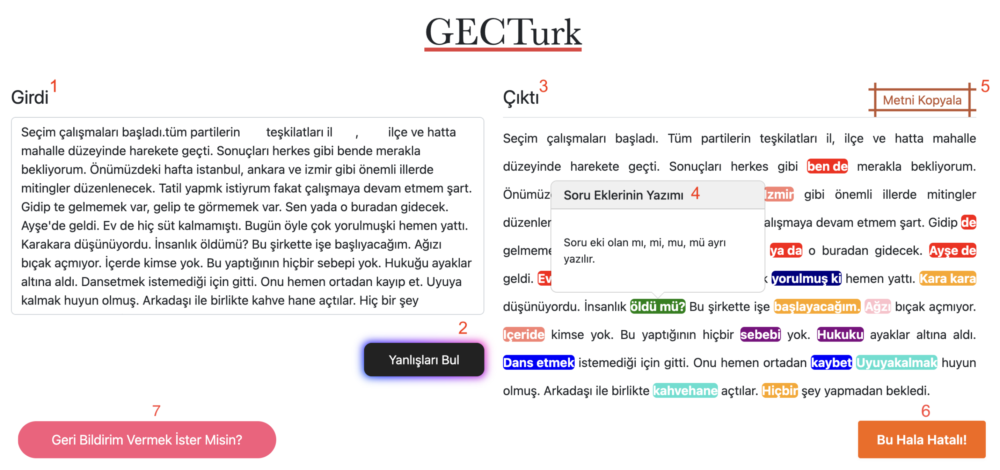

Your README is comprehensive and well-organized. Here are a few enhancements and revisions to improve clarity and readability:

---

# GECTurk WEB: An Explainable Online Platform for Turkish Grammatical Error Detection and Correction

## Table of Contents
1. [Overview](#overview)
2. [Features](#features)
3. [Installation](#installation)
4. [Usage](#usage)
   - [Input and Output](#input-and-output)
   - [Example Usage](#example-usage)
5. [System Architecture](#system-architecture)
6. [Evaluation](#evaluation)
7. [Contributing](#contributing)
8. [License](#license)
9. [Acknowledgements](#acknowledgements)
10. [Contact](#contact)

## Overview

**GECTurk WEB** is an open-source web-based tool designed to detect and correct common grammatical and spelling errors in Turkish text. The system not only corrects mistakes but also provides explanations for each correction, helping users learn and understand Turkish grammatical rules better. The platform is accessible both online and offline, making it a flexible tool for native speakers and second language learners alike. You can try out GECTurk WEB at [www.gecturk.net](https://www.gecturk.net/) online or set it up locally using the instructions below.

<p align="center">

<br>
<small><b>Figure 1: The screenshot of UI after user entering an input. 1- Girdi (Input): The input area for the user. 2- Yanlışları Bul (Find Errors): A button pressed after entering an input. 3- Çıktı (Output): The output area for the tagged and corrected text. 4- Pop-up: Each corrected word is represented as a button. When clicked, the violated rule, i.e., error type, is shown. 5- Metni Kopyala (Copy Text): A button for copying corrected text. 6- Bu Hala Hatalı (Still Erroneous): A button for giving feedback if the user thinks the output still contains errors. When clicked, a pop-up is shown and the user is expected to write the corrected version. 7- Geri Bildirim Vermek İster Misin? (Give Feedback): A button for collecting general suggestions.</b></small>
</p>

## Features

- **Grammatical Error Detection and Correction**: Identifies and corrects a variety of Turkish grammatical errors including misuse of diacritics, compound words, foreign words, pronouns, and light verbs.
- **Spelling Correction**: Integrates with TrNlp and ZemberekNLP for correcting spelling errors and proper noun capitalization.
- **Interactive Explanations**: Provides color-coded explanations for each correction, enhancing the learning experience.
- **User Feedback Mechanism**: Allows users to provide feedback on corrections to improve the system continuously.
- **Usability**: Achieved a system usability score of 88.3, indicating excellent usability and user satisfaction.
- **Open Source**: The source code is available under the CC BY-SA 4.0 license.

## Installation

To set up GECTurk WEB locally, follow these steps:

1. **Clone the Repository**

   ```bash
   git clone https://github.com/GGLAB-KU/gecturkweb.git
   cd gecturkweb
   ```

2. **Download the Model**

    Download the model file from [Hugging Face](https://huggingface.co/GGLab/gec-tr-seq-tagger) and place it in the `gecturkweb/seqtagmodel/sequence-tagger` directory.

3. **Install Dependencies**

   Ensure you have Python 3.11 and pip 24.1.2 installed. Then, install the required packages:

   ```bash
   pip install -r requirements.txt
   ```

4. **Run the Server**

   Start the development server:

   ```bash
   python manage.py runserver
   ```

5. **Access the Application**

   Open your browser and navigate to `http://localhost:8000/` to access GECTurk WEB locally.

## Usage

### Input and Output

- **Input Area**: Enter the text you want to check for grammatical errors.
- **Find Errors**: Click this button to process the input text.
- **Output Area**: View the corrected text with color-coded error explanations.
- **Copy Text**: Copy the corrected text to your clipboard.
- **Feedback**: Provide feedback if you think the output still contains errors.

### Example Usage

1. Enter a sentence in the input area, e.g., "Sonuçları herkes gibi bende merakla bekliyorum."
2. Click "Find Errors".
3. The output area will show the corrected sentence, "Sonuçları herkes gibi ben de merakla bekliyorum." with "ben de" highlighted and an explanation provided.

## System Architecture

GECTurk WEB consists of the following three components:

1. **Frontend**: Built using the Bootstrap framework for a responsive and user-friendly interface.
2. **Backend**: Powered by Django, a high-level Python web framework.
3. **Grammatical Correction Module**: Utilizes the SequenceTagger model for detecting and correcting grammatical errors.
4. **Spelling Correction Module**: Integrates TrNlp and ZemberekNLP for spelling correction.

## Evaluation

GECTurk WEB has been evaluated for usability and effectiveness through a comprehensive user study. The tool achieved an average System Usability Scale (SUS) score of 88.3 and a SUPR-Q score of 4.34, indicating high user satisfaction and usability. Additionally, 80% of participants reported that they learned or remembered a grammatical rule after using the tool.

## Contributing

We welcome contributions from the community. Please fork the repository and submit pull requests with your changes.

## License

GECTurk WEB is licensed under the [CC BY-SA 4.0](https://creativecommons.org/licenses/by-sa/4.0/) license.

## Acknowledgements

- GECTurk WEB was developed as part of the senior design project by [Ali Gebeşçe](https://github.com/aligebesce), [Asu Tutku Gökçek](https://github.com/AsuTutkuGokcek), [Gökçe Sevimli](https://github.com/gokcesevimli), [Yakup Enes Güven](https://github.com/yguven17) at the Computer Engineering Department of Koç University, under the supervision of Assistant Professor Gözde Gül Şahin. Subsequent enhancements were made by Ali Gebeşçe and Assistant Professor Gözde Gül Şahin at [GGLab](https://gglab-ku.github.io/).

- The GECTurk Model utilized by GECTurk WEB was developed by Atakan Kara, Farrin Marouf Safian, Andrew Bond, and Gözde Gül Şahin. For more details, please refer to the [paper](https://aclanthology.org/2023.findings-ijcnlp.26/) and [GitHub repository](https://github.com/GGLAB-KU/gecturk) of GECTurk.

- This project is supported by the [Scientific and Technological Research Council of Türkiye (TÜBİTAK)](https://www.tubitak.gov.tr/) as part of the project titled *Automatic Learning of Procedural Language from Natural Language Instructions for Intelligent Assistance* (Project No. 121C132).

## Contact

For any questions or support, please contact [Ali Gebeşçe](mailto:aligebesce13@gmail.com).
